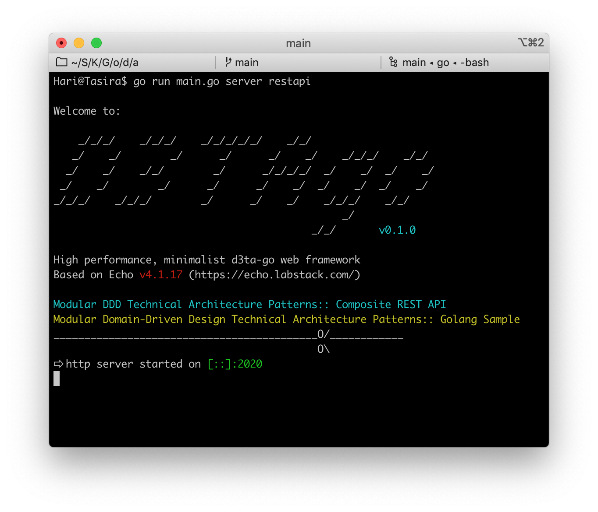
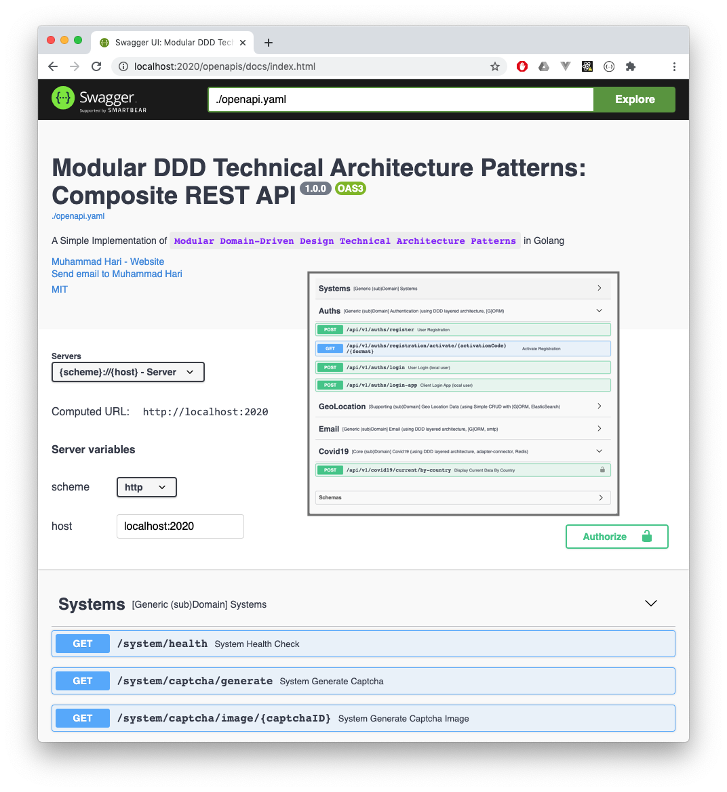

# app-restapi-composite

Interface/Presentation Layer: RESTAPI Composite Application Interface

A part of `Simple Implementation of Modular DDD Technical Architecture Patterns in Go`.

## Diagram v 0.2.2-Modular


## Components

A. Interface Layer (Composite Interface)

1. REST API - using Echo Framework [ [d3ta-go/app-restapi-composite](https://github.com/d3ta-go/app-restapi-composite) ]

B. DDD Modules:

1. Geolocation - using DDD Layered Architecture Pattern (CRUD-GORM) [ [d3ta-go/ddd-mod-geolocation](https://github.com/d3ta-go/ddd-mod-geolocation) ]
2. Authentication - using DDD Layered Architecture (Contract, GORM) [ [d3ta-go/ddd-mod-account](https://github.com/d3ta-go/ddd-mod-account) ]
3. Email - using DDD Layered Architecture (Contract, GORM, SMTP) [ [d3ta-go/ddd-mod-email](https://github.com/d3ta-go/ddd-mod-email) ]
4. Covid19 - using DDD Layered Architecture (Contract, Adapters -> Connectors) [ [d3ta-go/ddd-mod-covid19](https://github.com/d3ta-go/ddd-mod-covid19) ]

C. Common System Libraries [ [d3ta-go/system](https://github.com/d3ta-go/system) ]:

1. Configuration - using yaml
2. Identity & Securities - using JWT, Casbin (RBAC)
3. Initializer
4. Email Sender - using SMTP
5. Handler
6. Migrations
7. Utils

D. Databases

1. MySQL (tested)
2. PostgreSQL (untested)
3. SQLServer (untested)
4. SQLite3 (untested)

E. Providers (Connectors) [ [d3ta-go/connector-\*](https://github.com/d3ta-go/connector-covid19) ]:

1. data.covid19.go.id (Official Covid19 Website - Indonesia)
2. covid19.who.it (Official Covid19 Website - WHO)

F. Persistent Caches

1. Session/Token/JWT Cache (Redis, File, DB, etc) [tested: Redis]
2. Indexer/Search Cache (ElasticSearch)

G. Messaging [to-do]

H. Logs [to-do]

### Development

1. Clone

```shell
$ git clone https://github.com/d3ta-go/app-restapi-composite.git
```

2. Setup

```
a. copy `conf/config-sample.yaml` to `conf/config.yaml`
b. copy `conf/data/test-data-sample.yaml` to `conf/data/test-data.yaml`
c. setup your dependencies/requirements (e.g: database, redis, elasticsearch, smtp, etc.)
```

3. Runing on Development Stage

```shell
$ cd app-restapi-composite
$ go run main.go db migrate
$ go run main.go server restapi
```

4. Build

```shell
$ cd app-restapi-composite
$ go build
$ ./app-restapi-composite db migrate
$ ./app-restapi-composite server restapi
```

5. Distribution (binary)

Binary distribution (OS-arch):

- darwin-amd64
- linux-amd64
- linux-386
- windows-amd64
- windows-386

```shell
$ cd app-restapi-composite
$ sh build.dist.sh
$ cd dist/[OS-arch]/
$ ./app-restapi db migrate
$ ./app-restapi server restapi
```

**RESTAPI (console):**



**Swagger UI (openapis docs):**

URL: http://localhost:2020/openapis/docs/index.html



**Related Domain/Repositories:**

1. DDD Module: Account (Generic Subdomain) - [d3ta-go/ddd-mod-account](https://github.com/d3ta-go/ddd-mod-account)
2. DDD Module: Email (Generic Subdomain) - [d3ta-go/ddd-mod-email](https://github.com/d3ta-go/ddd-mod-email)
3. DDD Module: GeoLocation (Supporting Subdomain) - [d3ta-go/ddd-mod-geolocation](https://github.com/d3ta-go/ddd-mod-geolocation)
4. DDD Module: Covid19 (Core Subdomain) - [d3ta-go/ddd-mod-covid19](https://github.com/d3ta-go/ddd-mod-covid19)
5. Common System Libraries - [d3ta-go/system](https://github.com/d3ta-go/system)

**Online Demo:\***

> Due the limitation of our server spec (for ELK: Elasticsearch/Kibana). We cannot provide the online demo for this repo. Very sorry for the inconvenience.

Available Online Demo:

1. Account REST API Microservice - [d3ta-go/ms-account-restapi](https://github.com/d3ta-go/ms-account-restapi)
2. Email REST API Microservice - [d3ta-go/ms-email-restapi](https://github.com/d3ta-go/ms-email-restapi)
3. Covid19 REST API Microservice - [d3ta-go/ms-covid19-restapi](https://github.com/d3ta-go/ms-covid19-restapi)

**References:**

1. [Book] Domain-Driven Design: Tackling Complexity in the Heart of Software 1st Edition (Eric Evans, 2004)

2. [Book] Patterns, Principles, and Practices of Domain-Driven Design (Scott Millett & Nick Tune, 2015)

**Team & Maintainer:**

1. Muhammad Hari (https://www.linkedin.com/in/muharihar/)
